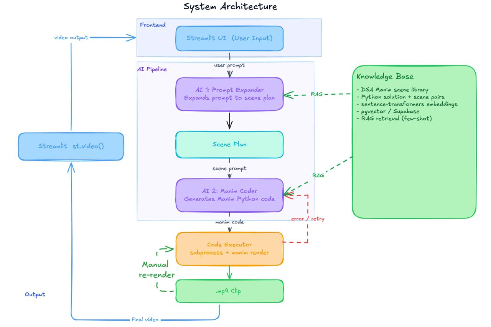

# Manim AI Visualiser
## [Live Demo](https://algoviz.streamlit.app/)


A multi-agent pipeline that converts natural language descriptions of algorithms and data structures into animated Manim visualizations.

**Input:** A text prompt describing a DSA concept
**Output:** A rendered `.mp4` animation

---

## How It Works

```
User Prompt
  → [1] Prompt Expander    — LLM call → structured scene plan (JSON)
  → [2] Manim Coder        — LLM call → Manim Python script (with self-healing)
  → [3] Render             — Manim CLI renders script to .mp4
  → [4] Finalize           — Output moved to outputs/video/
```

All four stages are orchestrated by `pipeline/executor.py`. Each stage writes its intermediate output to `outputs/raw_responses/` for debugging.

---

## Setup

### 1. Install dependencies

```bash
pip install -r requirements.txt
```

### 2. Configure environment

Create a `.env` file in the project root:

```env
LLM_PROVIDER=local
LOCAL_LLM_URL=http://127.0.0.1:1234/v1/chat/completions
```

For cloud providers, add the relevant key:

```env
LLM_PROVIDER=openai
OPENAI_API_KEY=...

# or
LLM_PROVIDER=anthropic
ANTHROPIC_API_KEY=...

# or
LLM_PROVIDER=gemini
GEMINI_API_KEY=...
```

### 3. (Optional) Enable knowledge base

To enable RAG-based example retrieval, add Supabase credentials and set `USE_KB=true`:

```env
SUPABASE_URL=https://<project>.supabase.co
SUPABASE_KEY=<anon-key>
USE_KB=true
```

Then run the embedding script to populate the vector store:

```bash
python knowledge_base/embeddings/embed.py
```

### 4. Run

**CLI:**
```bash
python -m pipeline.executor "explain bubble sort"
python -m pipeline.executor "explain Dijkstra's algorithm" --provider anthropic --quality m
```

**Web UI (Streamlit):**
```bash
streamlit run app.py
```

---

## Project Structure

```
manim_ai_visualiser/
├── app.py                              # Streamlit web interface
├── requirements.txt
├── agents/
│   ├── llm_client.py                   # Unified LLM call entry point
│   ├── prompt_expander.py              # Stage 1: prompt → scene plan
│   ├── manim_coder.py                  # Stage 2: scene plan → Manim script
│   └── prompts/
│       ├── expander_system.txt         # System prompt for scene planner
│       └── coder_system.txt            # System prompt for Manim coder
├── pipeline/
│   └── executor.py                     # Pipeline orchestrator + Manim render wrapper
├── knowledge_base/
│   ├── retriever.py                    # Supabase vector search with local fallback
│   ├── components/                     # Reusable Manim building blocks
│   │   ├── linear_data.py              # Arrays, linked lists, stacks, queues
│   │   ├── key-value_pairs.py          # Hash tables, dictionaries
│   │   ├── matrices.py                 # 2D grid visuals
│   │   ├── pointers.py                 # Pointer and reference animations
│   │   └── sets.py                     # Set operation visuals
│   ├── scenes/                         # Example scenes used for RAG retrieval
│   │   ├── binary_search.py
│   │   ├── bubble_sort.py
│   │   ├── merge_sort.py
│   │   ├── fibonacci.py
│   │   ├── kadanes_algorithm.py
│   │   ├── kruskal.py
│   │   └── ...
│   └── embeddings/
│       ├── embed.py                    # Embedding generation + Supabase upsert
│       └── schema.sql                  # Supabase vector table + RPC function
└── ui/
    └── components.py                   # Streamlit component library (stub)
```

---

## Architecture

### LLM Client (`agents/llm_client.py`)

Single entry point for all LLM calls: `call_llm(messages, temperature) → (content, elapsed_seconds)`.

Provider routing is controlled by the `LLM_PROVIDER` environment variable:

| Provider | Routing |
|----------|---------|
| `local` | OpenAI-compatible HTTP to `LOCAL_LLM_URL` (LM Studio / Ollama) |
| `openai` | OpenAI API via `openai` SDK |
| `anthropic` | Anthropic Messages API — system prompt extracted from `messages[]` automatically |
| `gemini` | Google Gemini SDK — system instruction passed via `GenerateContentConfig` |

All agents call only `call_llm()` and are unaware of the active provider. Model can be overridden per-provider via environment variables.

---

### Stage 1 — Prompt Expander (`agents/prompt_expander.py`)

- **Input:** Plain-text user prompt
- **Output:** JSON scene plan string
- **Temperature:** 0.2
- **System prompt:** `agents/prompts/expander_system.txt`

The expander instructs the LLM to produce a structured scene plan describing animation layout, visual zones, code snippets, variable traces, and narration for each scene. Two layout modes are supported:

- **3-Zone** (default for DSA): left panel for the main visual, top-right for code/logic steps, bottom-right for variable trace table
- **Full-Screen**: used for conceptual or intro/outro scenes

---

### Stage 2 — Manim Coder (`agents/manim_coder.py`)

- **Input:** Scene plan JSON string
- **Output:** Manim Python script
- **Temperature:** 0.2
- **System prompt:** `agents/prompts/coder_system.txt`
- **Self-healing:** Up to 3 retries on `py_compile` failure, with the error traceback appended to the message history for the LLM to fix

Key functions:

| Function | Purpose |
|----------|---------|
| `generate_manim_script(scene_plan)` | Main entry point — generates and validates a script |
| `fix_manim_script(scene_plan, code, stderr)` | Runtime error recovery — patches a previously generated script |
| `_extract_code(raw)` | Strips markdown fences from LLM response |
| `_validate_code(code)` | Syntax check via `py_compile` in a temp file |

---

### Stage 3 — Render (`pipeline/executor.py`)

The executor invokes the Manim CLI directly:

```bash
python -m manim render --media_dir <path> <quality_flag> <script_path>
```

On render failure, the stderr is passed to `fix_manim_script()` and the fixed script is re-rendered (up to 3 attempts). Intermediate fixes are saved to `raw_responses/` for traceability.

Quality flags map to Manim's built-in presets: `-ql` (480p), `-qm` (720p), `-qh` (1080p).

---

### Knowledge Base (`knowledge_base/`)

Optional RAG context injected into both the expander and coder prompts.

**Retrieval strategy (`retriever.py`):**

1. **Supabase (primary):** pgvector cosine similarity search via `match_manim_examples()` RPC
2. **Local fallback:** In-process `sentence-transformers` embeddings with numpy cosine similarity over all `knowledge_base/scenes/*.py` files — no external dependency required

**Embedding pipeline (`embeddings/embed.py`):**

- Model: `sentence-transformers/all-MiniLM-L6-v2` (384-dimensional embeddings)
- Embeddings are generated from scene metadata (title, description, concepts) — not raw code
- Results are upserted to Supabase with `source_file` as the unique key, making re-runs idempotent

---

### Web UI (`app.py`)

A Streamlit interface providing:

- Provider and model selection (local / OpenAI / Anthropic / Gemini)
- Render quality selector
- Chat-style prompt input
- Video playback panel
- Code editor tab (`streamlit_ace`) with re-render support

---

## Key Design Decisions

- **Provider-agnostic agents** — all LLM calls go through `call_llm()`. Switching providers requires only a change to `LLM_PROVIDER` in `.env`.
- **Self-healing code generation** — both the coder and the executor implement independent retry loops with LLM feedback, covering syntax errors (pre-render) and runtime errors (post-render) separately.
- **RAG-optional pipeline** — the full pipeline runs without Supabase. The local fallback makes knowledge base retrieval available with no infrastructure beyond `pip install`.
- **No LaTeX** — all scenes use `Text()` only. Hard constraint enforced in both system prompts due to Manim rendering compatibility.
- **Canvas zone enforcement** — the expander system prompt defines strict x/y coordinate targets for each visual zone, reducing overlap in generated scenes.

---

## Dependencies

| Package | Purpose |
|---------|---------|
| `manim>=0.18.0` | Animation engine |
| `openai>=1.30.0` | LLM client (OpenAI and OpenAI-compatible endpoints) |
| `anthropic` | Anthropic Messages API client |
| `google-genai` | Google Gemini API client |
| `requests` | Fallback HTTP for local LLM calls |
| `python-dotenv>=1.0.0` | `.env` loading |
| `streamlit>=1.35.0` | Web UI |
| `sentence-transformers>=3.0.0` | Local embeddings for knowledge base retrieval |
| `supabase>=2.4.0` | Vector store (pgvector) |

---

## Output Layout

```
outputs/
  <session_id>/
    animation.py                        # Generated Manim script
    media/videos/<script>/<quality>/    # Manim render artifacts
  raw_responses/
    <session_id>_expander.json          # Scene plan from Stage 1
    <session_id>_coder.py               # Initial generated script
    <session_id>_coder_fix1.py          # Self-healing fix attempts (if any)
  video/
    final_<session_id>.mp4              # Final rendered video
```
